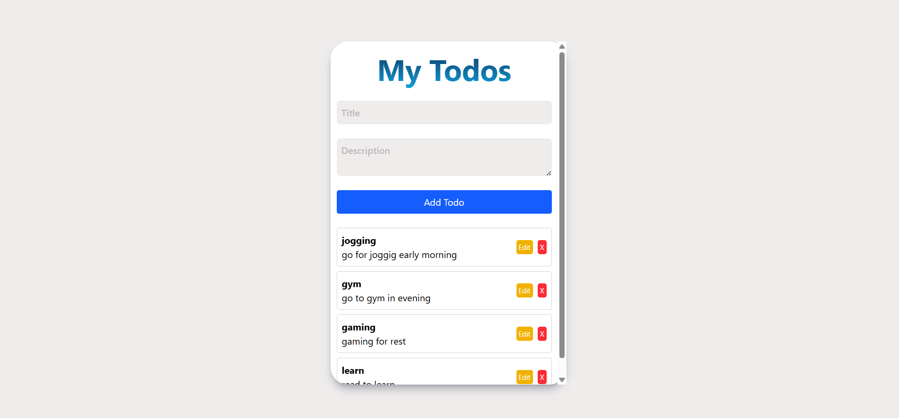
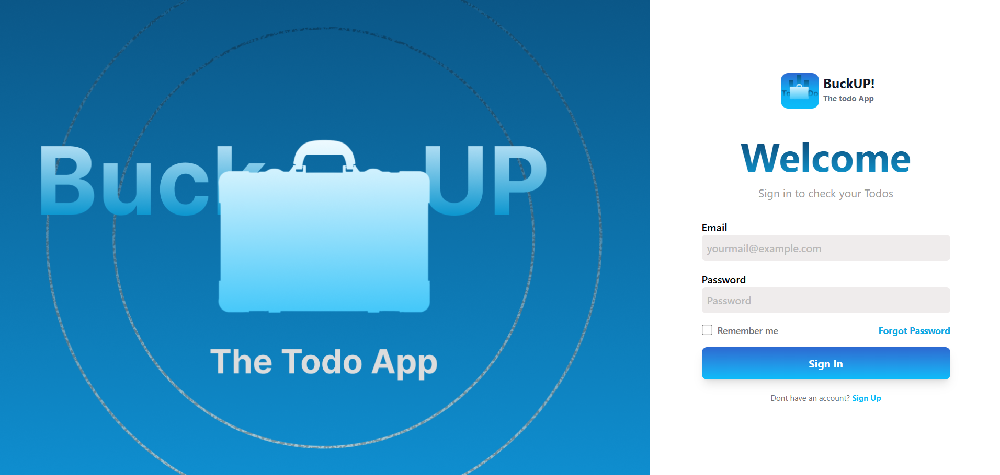
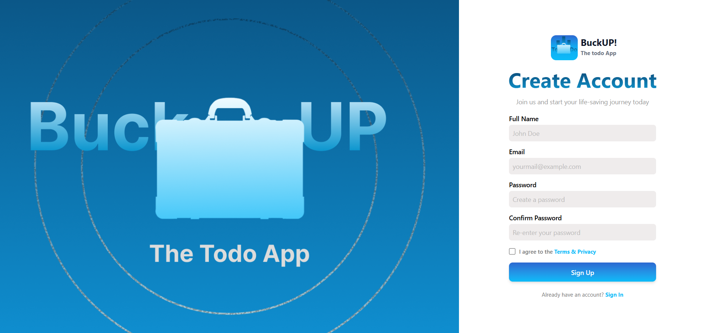

                                                              ********** BUCK UP ***********
BUCK_UP is a sleek Basic to-do Application  designed to help you organise your  task efficently , It consisits of Create , update , delete their
todos while keeping the data synced with backend server.

Hey There,
* This is my Full stack Todo  Web Application made with Mongo DB, Expree ts, React ts and Node ts.
* I made this specifically in Typescript for Type Safety , I dont work much on Typescript but i work more on Java Script .

                                                              *********** Features **********
* I Added JWT auth using bcrypt js and cookie parser to manage personal todos.
* You can do the Create todos, Update Todos, delete Todos.
* Your Todos will be updated in the database in the real-time, React Query is used to keep your todo list always up-to-date.
* Backend  API with Node ts , express ts and Mongo DB , ensuring data is safely stored per user.

                                                           ************ Tech Stack ***********
*Frontend : React + Tailwind + React Query + React Router(with zod schemas) + zustand + React hook form for handling forms
*Backend : Node js+ Expres js+ Mongo DB + Mongoose
*Authentication : JWT (Json Web Tokens) 
*HTTP Client : Axios

                                                          *********** Insatllation **********
Clone the Repository : git clone https://github.com/RAJKUMARKARN/Buck-UP.git >> cd Buck_up
Install frontend Dependencies : cd Frontend >> npm i || npm install
Install Backend Dependencies : cd Backend >> npm i || npm install
Create .env file in the backend folder with your MongoDB connection string and JWT secret:
{
MONGO_URI=your_mongodb_connection_string
JWT_SECRET=your_jwt_secret
PORT=5000 
}

                                                          **********Backend Server **********
Start the Backend sever : cd Frontend >> npm run dev
Start the Frontend Server : cd Backend >> npm run dev

